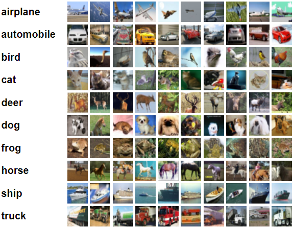
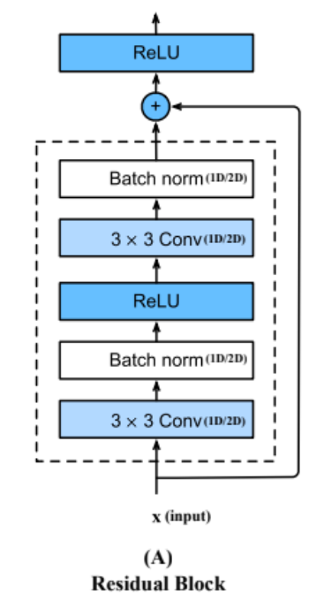
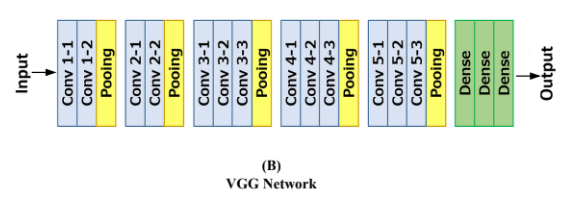
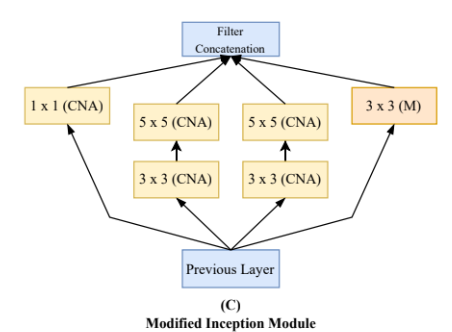

The /DLA2/DLA2/Pipeline/2021061A2.py file has implementation for classification :-

Two datasets :  
A) Image Dataset :: [torchvision.datasets.CIFAR10](https://pytorch.org/vision/main/generated/torchvision.datasets.CIFAR10.html)   
[CIFAR-10](https://www.cs.toronto.edu/~kriz/cifar.html) dataset contains 60,000 32x32 color images in 10 different classes.

B) Audio Dataset :: [torchaudio.datasets.SPEECHCOMMANDS](https://pytorch.org/audio/main/generated/torchaudio.datasets.SPEECHCOMMANDS.html)  
Speech Commands Dataset, and used it to add training* and inference sample code to TensorFlow. The dataset has 65,000 one-second long utterances of 30 short words, by thousands of different people.

---

And implemented achitecture fro the above datasets :
1) ResNet Architecture :  
    The network comprising 18 blocks as depicted below.

    
2) Mod-VGG Architecture :  
    The modified VGG architecture. After each pooling layer, the number of channels is reduced by 35%, and the kernel size is increased by 25% (with ceil rounding for float calculations). Here, (Conv n-m) denotes the nth block and mth layer within that block.

    
3) Mod-Inception Architecture :  
    The configuration of a single inception block, where (n×n (CNA)) denotes a sequence of convolution, batch normalization, and ReLU activation with an n×n convolution filter. 
    And i have construct a modified inception network comprising 4 such blocks.

    
4) Custom Architecture :  
    A custom network using the following combination of blocks and follow the channel reduction and kernel size increase as in VGG. 

    • Network Architecture  
    (a) Input Layer  
    (b) Residual Block × 2  
    (c) Inception Block × 2  
    (d) Residual Block × 1  
    (e) Inception Block × 1  
    (f) Residual Block × 1  
    (g) Inception Block × 1  
    (h) Residual Block × 1  
    (i) Inception Block × 1  
    (j) Classification Network  

    • A classification network here refers to a combination of either nn.Linear or nn.Conv1d, nn.Conv2d layers that produce logits for the classification task.

Moreover, refer [Environment Setup](environment_setup.txt) for the setting the environment for training or inference the models.
